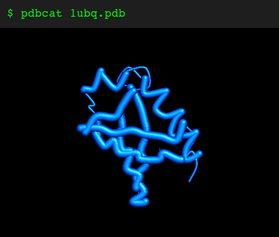
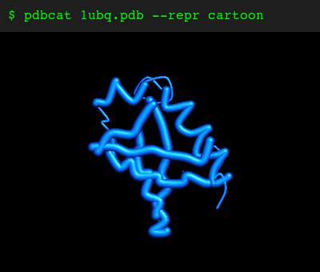
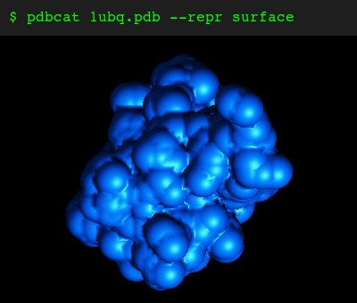
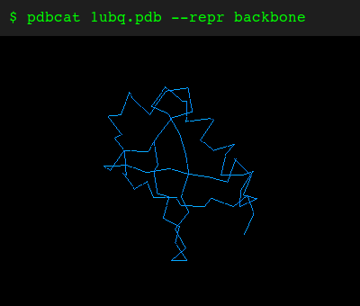
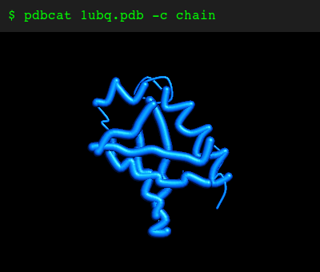
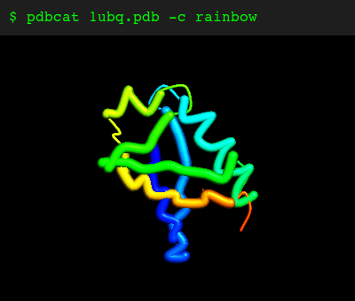
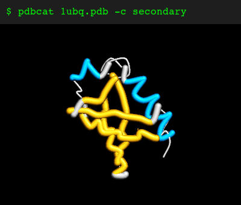
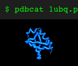

# pdbcat



A quick terminal viewer for PDB and mmCIF files. **Not a replacement for PyMOL or ChimeraX**—just a fast way to glance at a structure without leaving the terminal.

## Examples

### Representations

| Cartoon | Surface | Backbone |
|---------|---------|----------|
|  |  |  |

### Color Schemes

| Chain | Rainbow | Secondary Structure |
|-------|---------|---------------------|
|  |  |  |

### Half-Block Backend (any terminal)



## Installation

```bash
cargo install --path .
```

Or build from source:

```bash
cargo build --release
./target/release/pdbcat structure.pdb
```

## Usage

```bash
# Quick view (auto-detects terminal, renders to stdout)
pdbcat structure.pdb

# Different representations
pdbcat structure.pdb --repr cartoon      # default
pdbcat structure.pdb --repr surface
pdbcat structure.pdb --repr backbone

# Color schemes
pdbcat structure.pdb -c chain            # default
pdbcat structure.pdb -c rainbow
pdbcat structure.pdb -c secondary

# Force specific backend
pdbcat structure.pdb --backend iterm2
pdbcat structure.pdb --backend half

# Interactive mode (rotate with mouse, keyboard controls)
pdbcat structure.pdb -i

# Export to PNG
pdbcat structure.pdb -o output.png
```

## Command Line Options

| Option | Description |
|--------|-------------|
| `FILE` | Path to PDB or mmCIF file |
| `-i, --interactive` | Interactive mode with keyboard/mouse controls |
| `-o, --output PATH` | Export to PNG file |
| `-r, --resolution WxH` | Resolution (default: terminal size for stdout, 800x600 for -o) |
| `--repr MODE` | Representation: cartoon, surface, backbone |
| `-c, --color SCHEME` | Color scheme: chain, rainbow, secondary |
| `--bg COLOR` | Background: white, black (default), transparent |
| `--backend MODE` | Force render backend: iterm2, half (auto-detect if not set) |

## Interactive Mode Controls

| Key | Action |
|-----|--------|
| Mouse drag | Rotate |
| Scroll / `[` `]` | Zoom |
| Arrow keys | Pan |
| Tab | Cycle representation |
| `c` | Cycle color scheme |
| `0` | Reset view |
| `q` / Esc | Quit |

## Supported Formats

- **PDB** (.pdb)
- **mmCIF** (.cif, .mmcif)

## Terminal Compatibility

| Terminal | Backend | Quality |
|----------|---------|---------|
| iTerm2 | Inline images | Best |
| Any terminal | Half-block characters | Good |

The backend is auto-detected. Use `--backend` to override.

## License

MIT
